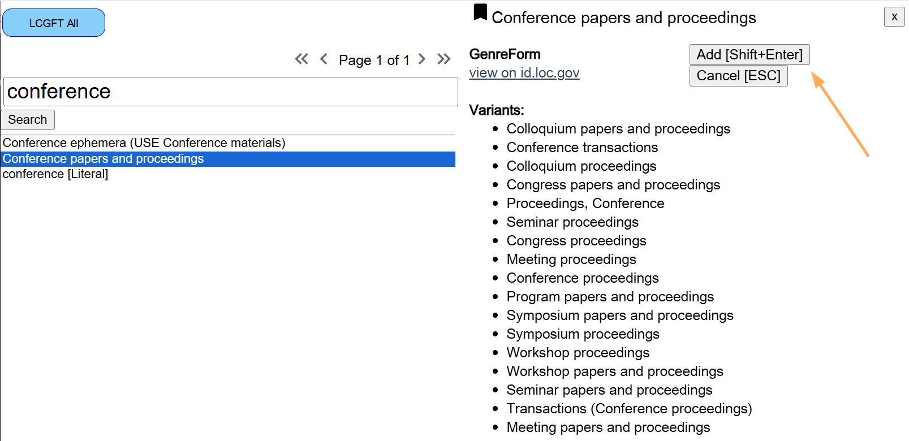
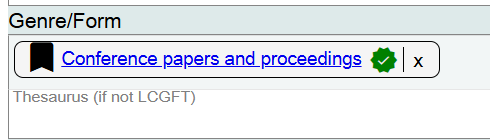
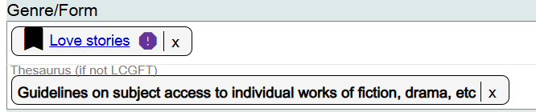
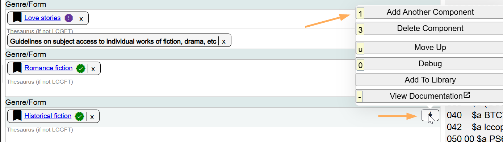
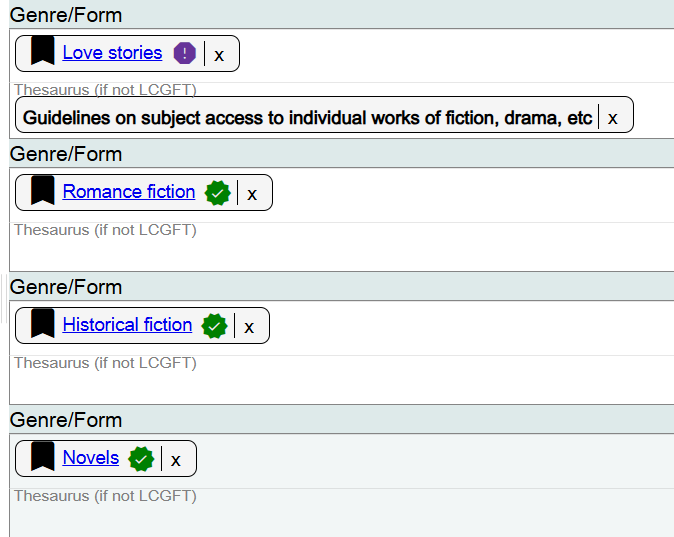

# Genre/Form

## Scope

This component is used for the genre or form of the Work.

## Folio / MARC

- MARC 655 field, Index Term - Genre/Form
- MARC 6XX subfield $v, LCSH form subdivision
- MARC 008 byte 24, 25, 26, 27, Nature of contents
- MARC 008 byte 29, Conference publication, value 1 = Conference publication

If you would record any of these values in Folio / MARC, then you should add the appropriate LCGFT headings here.

LCGFT is the default vocabulary.

## Search LCGFT

Search for the LCGFT term that you would record in the MARC 655 field, or for the closest LCGFT heading that corresponds to the values you would record as an LCSH form subdivision, record in the 008/24, or in the 008/29.

If you would not add an LCGFT heading in Folio / MARC, or you would not add an LCSH form subdivision in Folio / MARC, or you would not code the 008/24 in Folio / MARC, or you would not code the 008/29 in Folio / MARC, do not add an LCGFT heading in Marva.

(LCSH form subdivision $v Congresses)

(008/29 = 1)

## Thesaurus (if not LCGFT)

This is a drop-down list of controlled vocabularies for genres and forms. If you do not use an LCGFT heading in the Search LCGFT field, select the appropriate controlled vocabulary from the drop-down list.

To add additional Genre/Form headings, add a new component.

To change a Genre/Form heading, click on the **X** next to the heading and search for the correct heading.

[Back to Table of Contents](../index.md)
