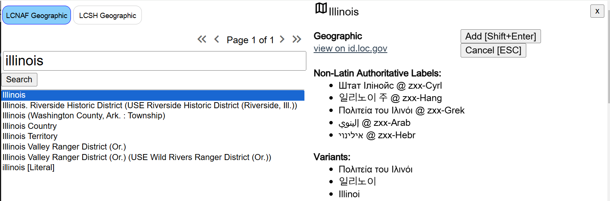
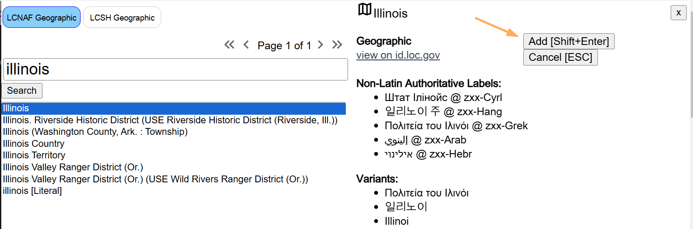
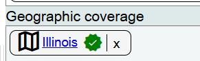
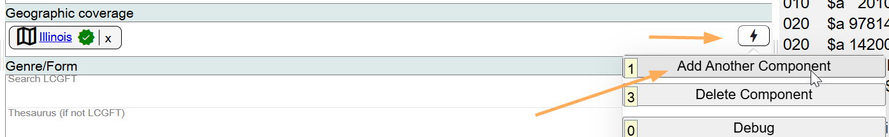
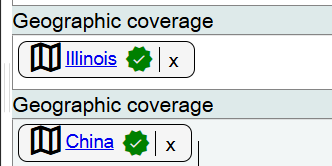
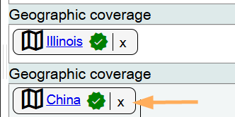
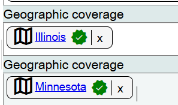
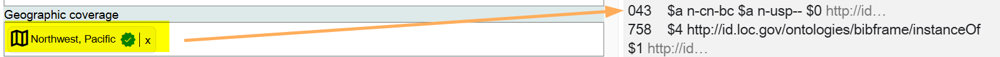

# Geographic Coverage

## Scope

This component is used to record the geographic coverage of a Work. The geographic coverage is usually based on the geographic headings or subdivisions added in the [Subjects](subjects.md) component. Marva pulls geographic codes from the MARC 043 field in geographic name authority and subject authority records in ID.LOC.GOV.

## Folio / MARC

- 043 field, Geographic Area Code or GAC

## Search LCNAF or LCSH

Although in the 043 field in Folio / MARC, codes are recorded in a structured way, for example:

- `n-us-il`
- `e-ur---`
- `a-cc---`

in Marva, the lookup in Search LCNAF or LCSH will look for the authority records for the places. Search for the authorized access point forms of the place(s). Do not search using the MARC 043 Geographic Area Codes.

There is currently no limit on the number of places that can be recorded in the Geographic coverage component.

To add additional place names, add additional Geographic coverage components for each place name.

To change or edit information in the Geographic coverage component, click on the **X** at the end of the place name to delete the value, then search for the desired name.

## Geographic Regions in LCSH

Some authority records for regions in LCSH will have 043 (GAC) fields that will allow you to select the region, and have the GACs populate the Geographic coverage component.

If you encounter an LCSH regional heading (not the free-floating use of Region with an existing place name in the LCNAF or in LCSH), and that regional heading does not contain 043 (GAC) fields, please report this to NetDev or to PTCP so that the GACs can be added to the authority record in ID.LOC.GOV.

[Back to Table of Contents](../index.md)
