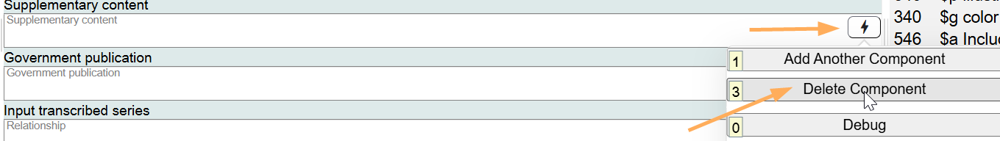
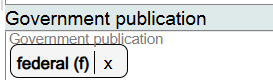
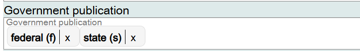

# Government Publication

## Scope

This component is used to identify government involvement in the creation or publication of the Work.

## Folio / MARC

- 008/29, Government publication

## Government Publication

This is a drop-down list for controlled values. Select the appropriate value(s).

If you want to record additional values for Government publication values for the Work, they can be added to the same field.

If the component is no longer needed, delete it.

[Back to Table of Contents](../index.md)
