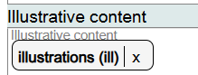
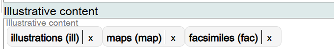
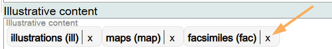
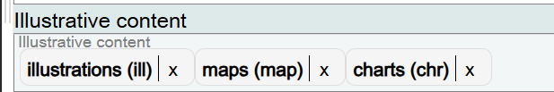
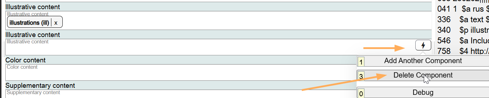

# Illustrative Content

## Scope

This component is used to identify the presence of illustrations in the Work.

## Folio / MARC

- 008/18-21, Illustrations
- 340 $p

## Illustrative Content

This is a drop-down list for controlled values. **Illustrations (ill)** is the default value for recording the presence of illustrations in a Work.

Other values may be recorded for more specific types of illustrations.

If you want to record additional values for illustrations in the Work, they can be added in the same field.

To change information in this component, click on the **X** next to the Illustrative content value, and search for the new value.

If the component is no longer needed, delete it.

[Back to Table of Contents](../index.md)
