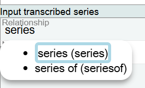
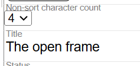
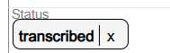
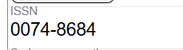
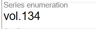
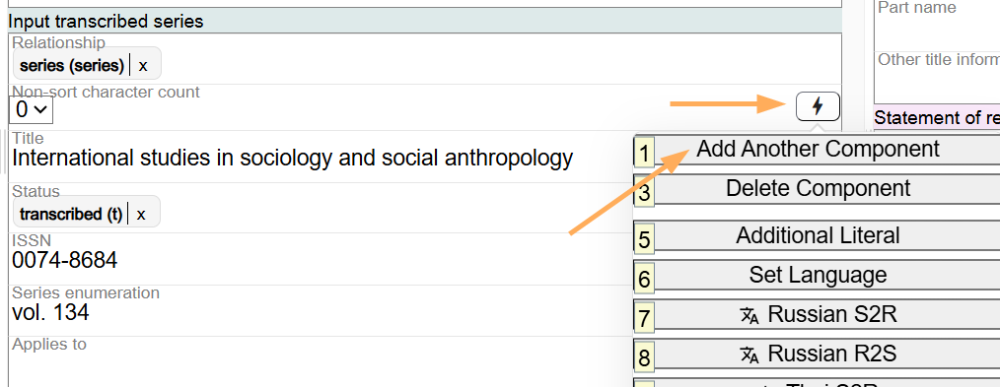
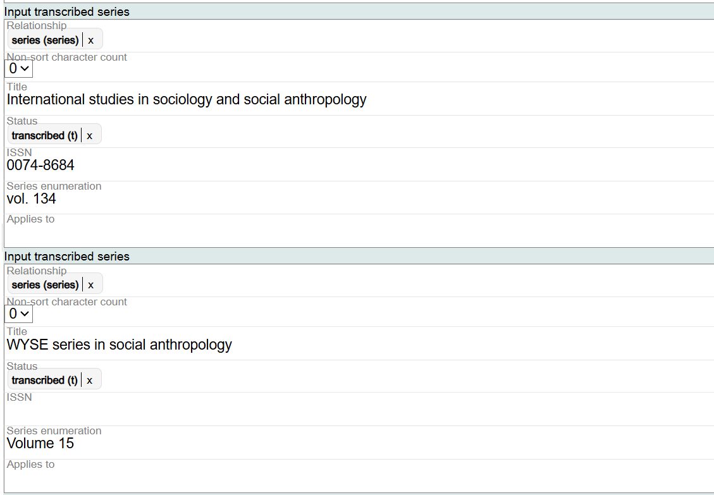
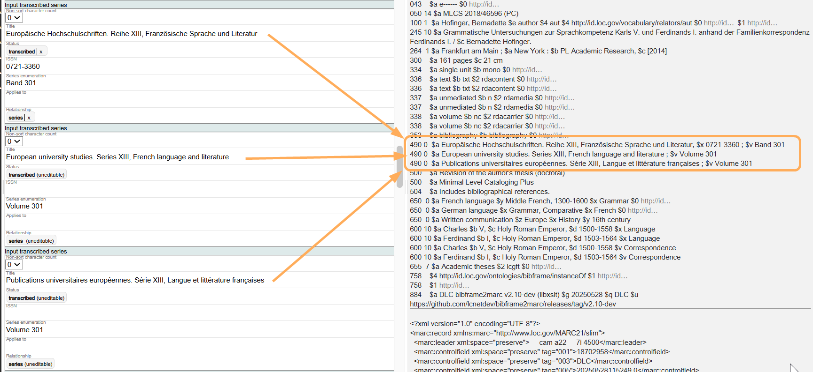
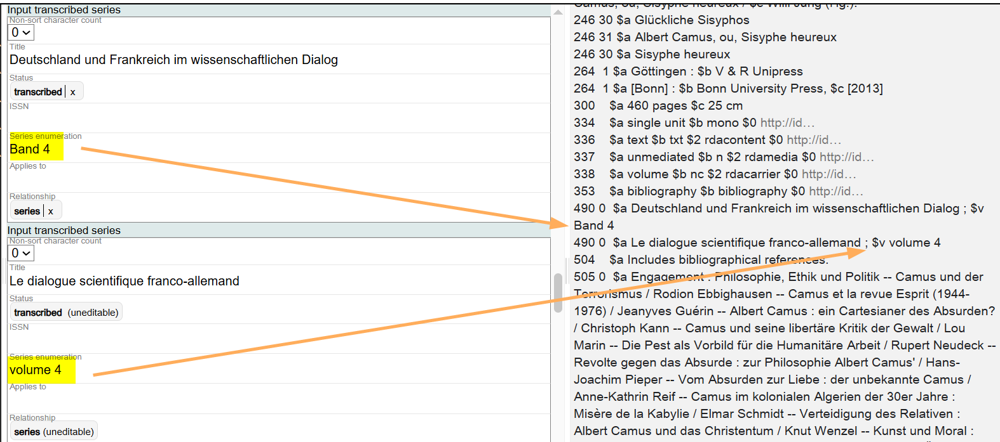
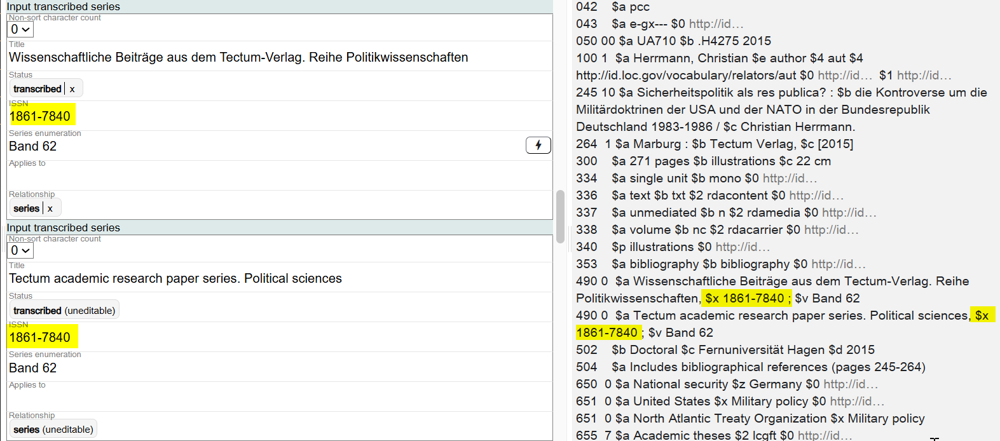

# Input Transcribed Series

## Scope

This component is used to transcribe a series statement associated with the Work.

## Folio / MARC

- 490 field, Series Statement

## Relationship

This is a drop-down list for controlled values. Select the appropriate value(s). The default value is "series."

## Non-sort Character Count

In the MARC 490 field, initial articles are omitted from transcribed series statement because there is not a non-filing indicator for the field. In Marva, transcribe initial articles and set the Non-sort character count to disregard them.

## Title

This is a transcription field in which the series statement as it appears on the resource is input, including any initial articles. Do not add ending punctuation.

## Status

This is a drop-down list. Because LC does not "trace" series, the value for status will generally be "transcribed."

## ISSN

Record the ISSN here if present on the resource. Include integral punctuation such as the "-" between the digits.

## Series Enumeration

Record a designation of the sequencing of a part or parts within a series in this field. Use the designation as it appears on the resource.

## Applies To

This is a literal field for more details on the relationship between the series and the resource being described.

If you want to transcribe additional series statements for the Work, add additional components.

To change information in the Relationship or Status, click on the **X** next to the term, and search for a new value. To change information in the Title, ISSN, or Series enumeration, delete and add information using the keyboard since these are literal fields. To change the Non-sort character count, use the drop-down arrow to select the correct value.

---

## Parallel Series Titles and Marva

The MARC Bibliographic 490 field, Series Statement, is intended to accommodate transcription of a series from a resource. But in addition, the field allows for ISBD punctuation and subfield coding, making it a hybrid type of field.

Subfield $a, Series statement, is repeatable when a subseries is separated from the main series by the numbering of the main series in subfield $v or by the ISSN in subfield $x, or when a series has a parallel title:

`490 1# $a Papers and documents of the I.C.I. Series C, Bibliographies ; $v no. 3 = $a Travaux et documents de l'I.C.I. Serie C, Bibliographies ; $v no 3`

In Marva, parallel series titles and associated part(s), numbering, and ISSNs, will appear in a separate Input transcribed series component, to allow access to the parallel title. In the Modern MARC record, the parallel series and any and associated part(s), numbering, and ISSNs, will appear in separate 490 fields.

### Parallel Series, Numbering, and ISSNs

When there is a piece designation in addition to numbering for a parallel series situation, the piece designation will likely be different for each of the titles.

`490 0# $a Deutschland und Frankreich im wissenschaftlichen Dialog ; $v Band 4 = $a Le dialogue scientifique franco-allemand ; $v volume 4`

In this scenario, the piece designation and numbering will appear in separate components in Marva, along with the series title.

If there is numbering only for a parallel series title situation, and no series designation, the numbering will only appear once in the MARC record in the 490 field with the parallel series titles.

`490 0# $6 880-07 $a Yuhaksaeng sirijŭ = $a Ryūgakusei shirīzu ; $v 2`

When this record is imported into Marva, the series numbering will only appear in one of the Input transcribed series components.

Because the BIBFRAME to MARC conversion will generate two 490 fields, as a best practice, repeat the numbering in both components in Marva.

Follow the same best practice for ISSN when it appears once in a MARC record with a parallel series statement.

`490 0# $a Wissenschaftliche Beiträge aus dem Tectum-Verlag. Reihe Politikwissenschaften = $a Tectum academic research paper series. Political sciences, $x 1861-7840 ; $v Band 62`

---

## Bibliographic Maintenance and 440 Fields in MARC

LC stopped "tracing" series in 2006. Before that, a series statement in a resource needed to be checked against the name authority file, and if there was a series authority record (SAR) supporting the series statement, and the authorized heading for the series matched the series statement in the resource, the series statement would be recorded ("traced") in the 440 field of the bibliographic record.

The 440 field was made obsolete in 2008.

If the series statement in a resource could be connected to a series authority record, but the authorized heading for the series was in a different form, the cataloger would transcribe the series statement from the resource in a 490 field with first indicator 1 (Series traced), and the authorized heading for the series would be recorded in the 8XX area of the bibliographic record.

Since 2006, LC catalogers transcribe series statements in the 490 field, with first indicator 0 (Series not traced).

When working on older LC bibliographic records, if a 440 field with a traced series is imported into Marva, the resulting Modern MARC record will convert the series statement to an 830 field. There will not be an accompanying 490 field in the Modern MARC record.

[Back to Table of Contents](../index.md)
