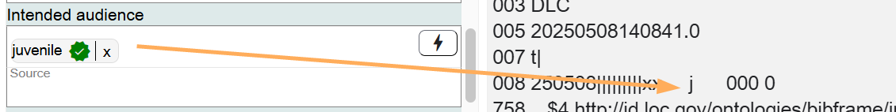
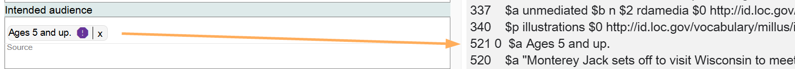
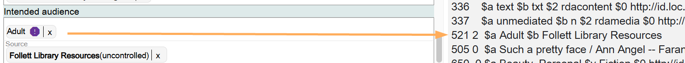
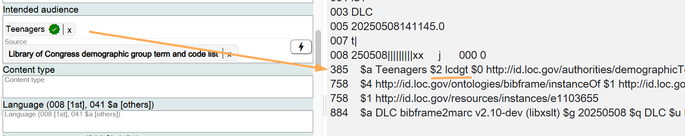

# Intended Audience

## Scope

This component is used for the intended audience of the Work.

## Folio / MARC

- 008/22 byte, Target audience
- 521 field, Target Audience Note
- 385 field, Audience Characteristics (Library of Congress Demographic Group Terms (LCDGT))

## Intended Audience

The Intended audience component can be used for lookups to the MARC Audience list (for the 008/22 byte), lookups to LCDGT, Library of Congress Demographic Group Terms (for the MARC 385 field), or literal values (for the MARC 521 field).

### MARC Audience List

Values selected from the MARC Audience list will populate the 008/22 Target audience byte. Value **j (Juvenile)** is required for juvenile materials.

Source is not required when using the MARC Audience list.

### MARC 521 Field (Target Audience Note)

The MARC 521 field, Target Audience Note, has limited structured data based on the indicators and subfield values used.

When a 521 field is unstructured, record the note in Marva as literal data, with no Source.

When a 521 field contains a subfield $b value, identify the source in the Source field. If the source is not present, use a literal value in the Source field.

### Library of Congress Demographic Group Terms (LCDGT)

Terms selected from Library of Congress Demographic Group Terms (LCDGT) will populate the 385 field, Audience Characteristics, in MARC. When selecting an LCDGT term, identify the Source in the component. Identifying the Source will add a subfield $2 value to the MARC description.

Using LCDGT terms is optional.

To add additional terms for Intended audience, add an additional component.

To change information in this component, click on the **X** next to the term and search for the new value.

If the component is no longer needed, delete it.

[Back to Table of Contents](../index.md)
