# Language

This section covers three related language components in Marva: Language (008), Language resource (041), and Language note.

---

## Language (008 [1st], 041 $a [others])

### Scope

This component is used to identify language(s) of the Work.

### Folio / MARC

- 008/35-37, Language
- 041 field, Language Code, when the Work has more than one language.

### Language

The same language codes that you would use in Folio / MARC are selected from the drop-down list.

Select the language that you would record in the Folio / MARC 008/35-37.

![Language (008 [1st], 041 $a [others]) showing "English (eng)" selected](../images/page048_img01.png)

If the Work has more than one language of primary content, add additional language codes in the same field.

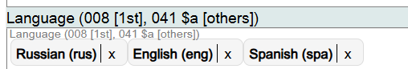

To change information in this component, click on the **X** next to the term and search for the new value.

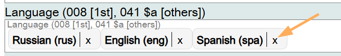

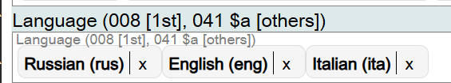

---

## Language Resource (041 $bdefgt)

### Scope

This component is used to identify languages of supplementary or supporting content in the Work.

### Folio / MARC

- 041 field, Language Code, subfields $b, $d, $e, $f, $g, and/or $t

### Type of Resource

This is a drop-down list. Select the appropriate value from the list.

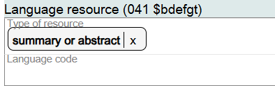

If there are additional resource types in the same language, the additional values can be added to the same field.

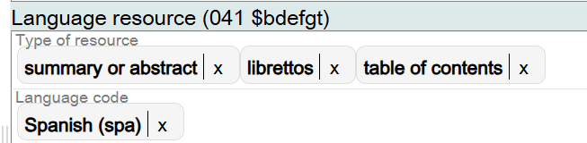

### Language Code

This is a drop-down list. Select the appropriate language from the list.

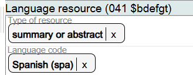

If there are additional languages of supplementary or supporting content in the Work, add additional language codes in the components if the Type of resource is the same.

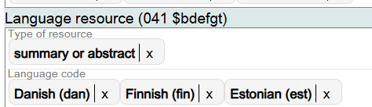

To change information in this component, click on the **X** next to the Type of resource or next to the Language code, and search for the new value.

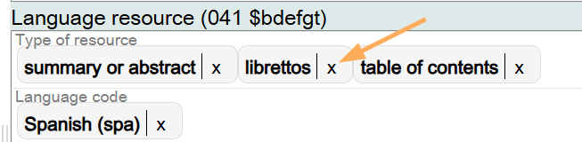

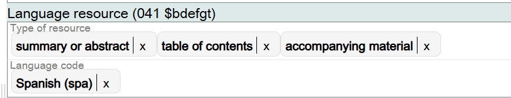

If the component is no longer needed, delete it.

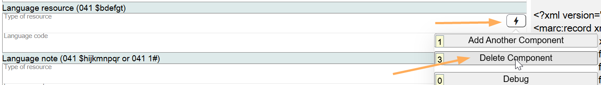

---

## Language Note (041 $hijkmnpqr or 041 1#)

### Scope

This component is used to identify translation information about the Work.

### Folio / MARC

- 041 field, Language Code, Indicator 1, Item is or includes a translation
- 041 field, Language Code, subfields $h, $i, $j, $k, $m, $n, $p, $q, and $r

### Language

If the resource being described contains subtitles, intertitles, an intermediate translation, captions, accessible audio, or accessible visual language, use a note to capture what is in a specific language and the language itself. (This instruction basically maps to the 041 $h, $i, $j, $k, $m, $n, $p, $q, and $r).

If the language of the resource being described is different than the original language of the resource, add a note indicating the original language.

In order to set the Folio / MARC 041 indicator 1 value to '1' ("Item is or includes a translation"), add a general note to the Work with the text "Includes translation or is translation" or simply "Includes translation".

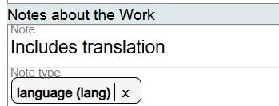

To change information in this component, click on the **X** next to the Type of resource or next to the Language code, and search for the new value.

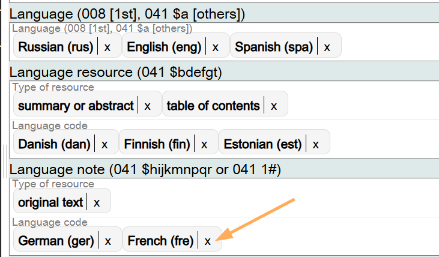

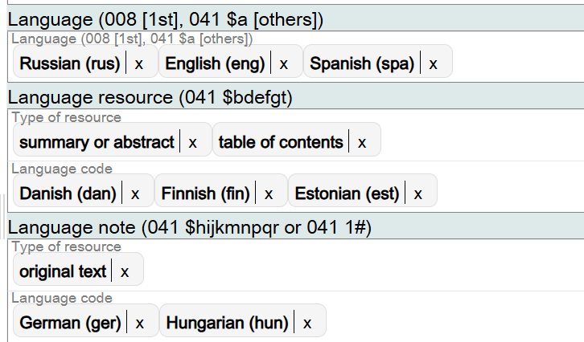

If the component is no longer needed, delete it.

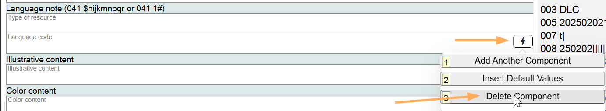

[Back to Table of Contents](../index.md)
