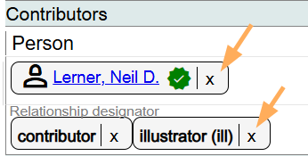
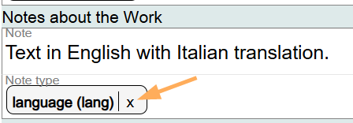

# Notes about the Work

## Scope

This component is used for notes relating to the Work.

## Folio / MARC

- 5XX fields

## Notes

**Notes in Marva are in flux. Most Notes will be recorded in the Instance description, not in the Work description. In Folio / MARC, each 5XX note has a specific definition. Being aware of the definition will help determine where the note goes, with the Work description, or with the Instance description.**

For now (February 2025), only record Notes relating to the **language** of the Work in this component in Marva.

In Folio / MARC this is the **546 field**, Language Note.

## Note

This is a literal field. Key in the note here. Ending punctuation is optional.

## Note Type

This is a drop-down list. Select **language**.

To change information in this component, use the delete key. This is a literal value so treat it as regular text. To delete the Note type, click on the **X** next to the term.

[Back to Table of Contents](../index.md)
