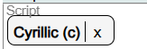
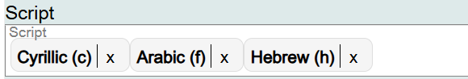
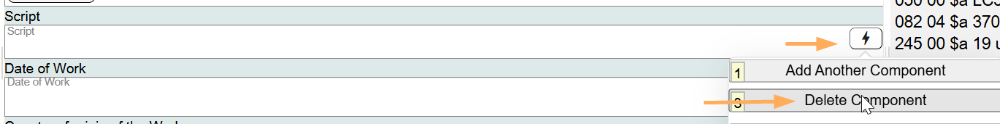

# Script

## Scope

Script is a core element for LC/PCC if a language is commonly written in more than one script, and if the Work is in a script other than the primary script for the language.

## Folio / MARC

- 546 field, Language Note, subfield $b, alphabet, script, or notation system that is used in the resource

## Script

This is a drop-down list for controlled values. Select the appropriate value.

If you want to record additional values for script information, they can be added in the same field.

To change information in this component, click on the **X** next to the Script value, and search for the new value.

If a component is not needed, delete it.

[Back to Table of Contents](../index.md)
