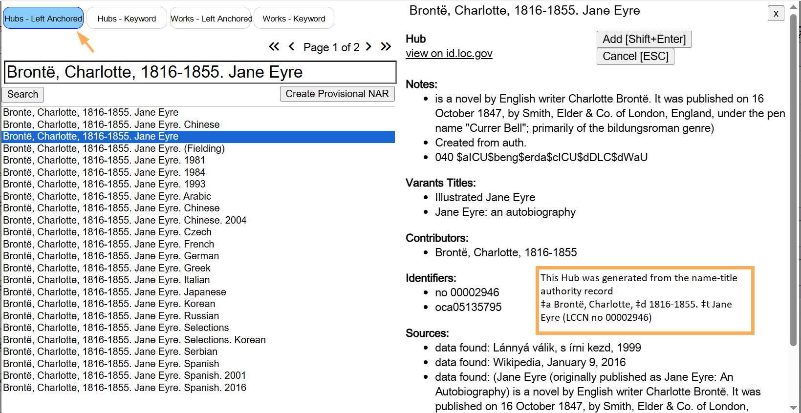
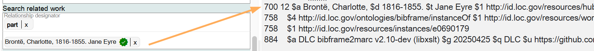
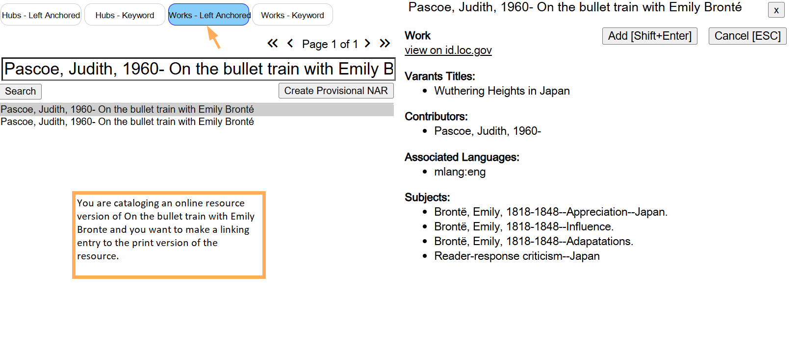
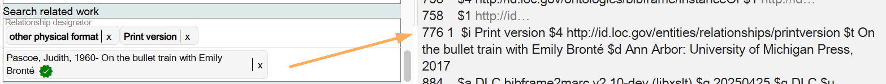
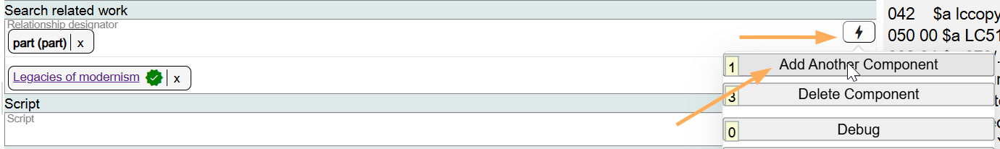
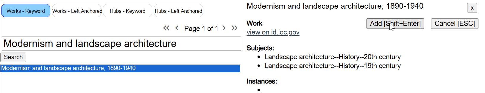
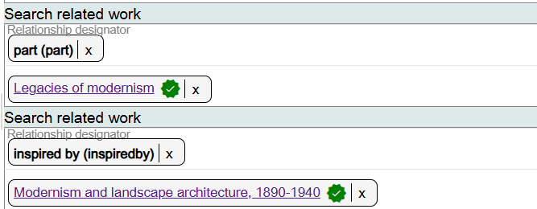
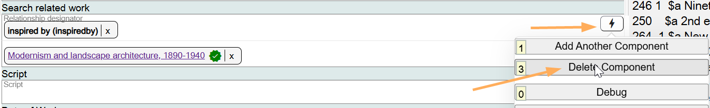

# Search Related Work

## Scope

This is a lookup search for identifying Works that are related to the Work being cataloged.

## Folio / MARC

- 7XX fields, Added Entry Fields and Linking Entry and Description Fields.

## Search Related Work

Related work is a core element for LC for compilations. Often the core requirement can be met by recording related works in a contents note. In some cases, a more structured access point needs to be given to record a related work. When a more structured access point is needed for a related work, use the Search related work option in Marva.

This is a lookup search for identifying access points for works in the BIBFRAME database (BFDB). There are four options for filtering and sorting when using this lookup:

1. **Hubs-Left Anchored**: this is the default option
2. **Hubs-Keyword**
3. **Works-Left Anchored**
4. **Works-Keyword**

### Using Hubs

The Hubs lookups (1. and 2.) will search all works that have either a 130 value, a 240 value, a 7XX value, or an 8XX value in MARC.

Hubs have been created from title and name-title authority records in the LC/NACO Authority File, including series authority records (SARs), but Hubs are also created from titles in 7XX and 8XX fields in MARC.

Using the Left Anchored options will arrange the result list in alphabetical order.

Use a **Hub** when you want to identify a related work added entry or an analytical added entry in the **700** field, the **710** field, the **711** field, or the **730** field of a MARC record.

### Using Works

The Works lookups (3. and 4.) will search all works that have a 245 value in MARC.

Use a **Work** when you want to identify a specific manifestation in a Linking Entry and Description Field (**76X-78X**) in a MARC record.

## Relationship Designator

This is a drop-down list. Select the appropriate value. The default value is "part" which means that the related work is included in the Work you are describing (this is also called an analytical added entry). If you are recording a related work that is **not** included in the Work you are describing, for example, a Work that is the inspiration for the Work you are describing, or a predecessor Work to the Work you are describing, use the appropriate relationship designator from the drop-down list.

If you want to search for an additional related Work, add an additional component.

To change information in Search related work, click on the **X** next to the term, and search for a new value.

If a component is not needed, delete it.

See [Appendix E: Hubs](../Reference/e-hubs.md) for more information.

[Back to Table of Contents](../index.md)
