# Subjects

## Scope

This component is used for recording controlled access to subject content of the Work.

## Folio / MARC

- 600, 610, 611, 630, 650, and 651 fields, Subject Access Fields

## Subject Components

There are four values for this field. **Subject components** is the default value.

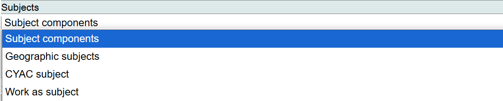

## Search LCSH/LCNAF

Assigning subjects can be a complex cataloging process in Marva since linking to authority records occurs in several ways. A complex LCSH string with a heading and one or more subdivisions might be linked to one authority record, if there is a corresponding LCSH authority record for the heading plus the subdivision(s). But because LCSH follows a free-floating subdivision practice, sometimes there is not an authority record for a complex string. In cases like this, each component of the string needs to be controlled as a separate component.

There are two ways to use Marva to input LCSH strings: **Build Mode** and **Link Mode**.

---

## Build Mode

### Search LCSH/LCNAF: Blackburn, Elizabeth H. (Elizabeth Helen), 1948-

Key in Blackburn, Elizabeth H. (Elizabeth Helen), 1948-.

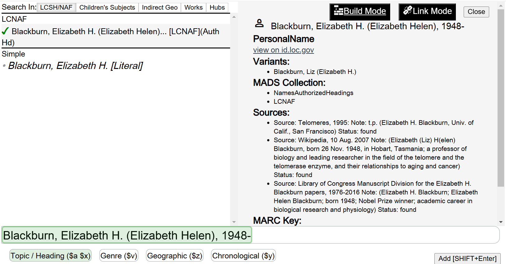

Marva will look up this name in both LCSH and in the LCNAF. Because this is a personal name, only the LCNAF values should be reviewed. If there is an authorized access point in the LCNAF for Blackburn, Elizabeth H. (Elizabeth Helen), 1948-, it will display in the search results in Marva. A view screen on the right-hand side of the screen can be used to view the complete authority record before assigning it.

Select the correct value and click on **Add [SHIFT+Enter]**. The authorized access point will be added as a Subject Added Entry - Personal Name in Marva. The thesaurus will be: Library of Congress subject headings.

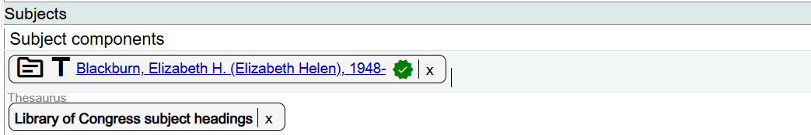

### Search LCSH/LCNAF: Biochemists--United States--Biography

Add a new Subject component.

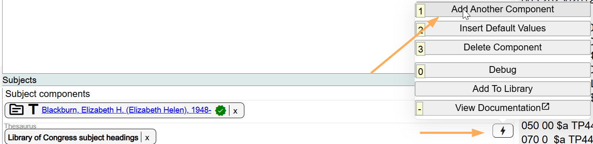

Key in **Biochemists--United States--Biography**. A pop-up box to the Subject Builder appears, with Biochemists and United States and Biography appearing in the search box, separated with double dashes (`--`). If the lookup can find a comprehensive URI for the string, it will display above the search box with (Auth Hd) at the end of the string. Click on the Auth Hd string, and the search box will show green highlighting, meaning that the entire string can be represented with a URI in the Subject component. Click on **Add [SHIFT+Enter]** to add the controlled string to the subject component. The thesaurus will be: Library of Congress subject headings.

In the case of **Biochemists--United States--Biography**, there is not a comprehensive URI for the entire string. The individual components of the string will need to be controlled as separate URIs.

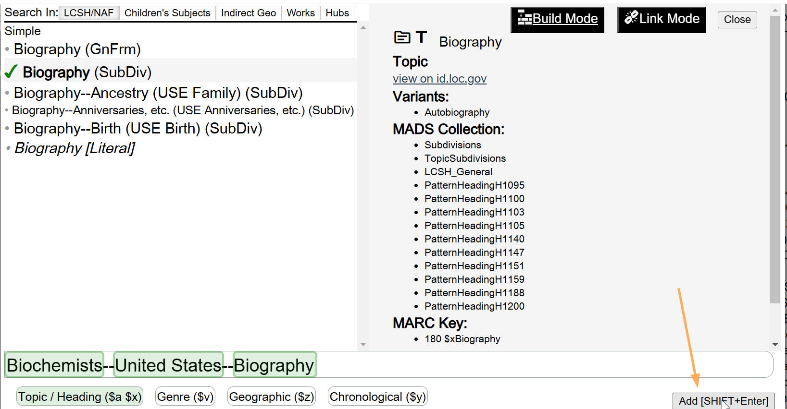

1. Click in the box with the heading **Biochemists**. Marva will search for the URI for this individual component. Click on Biochemists (Auth Hd), then click on **Topic / Heading ($a $x)** beneath the search box.

2. Next click in the box with **United States**. Marva will search for the URI for this individual component. Because LCSH uses indirect geographic subdivision for most geographic entities, the search will look for the value that would appear in the MARC Authority File 781 field. In this case, because United States cannot be used indirectly as a geographic subdivision, the value United States is used both as the authorized access point, and the geographic subdivision form. Click on United States [LCNAF] (GeoSubDiv), then click on **Geographic ($z)** beneath the search box.

3. Do the same for **Biography** (GnFrm).

4. Click on **Add [SHIFT+Enter]**. The LCSH string will be added as a Subject Added Entry - Topical Term in Marva. The thesaurus will be: Library of Congress subject headings.

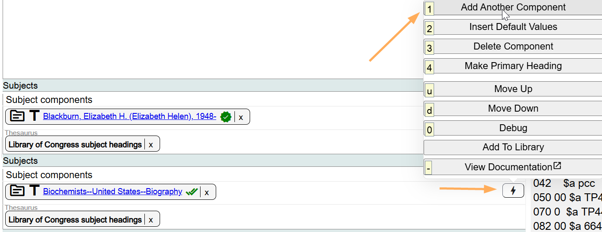

### Search LCSH/LCNAF: Telomere--History

Add a new Subject component.

Key in **Telomere--History**. A pop-up box to the Subject Builder appears, with Telomere and History appearing in the search box, separated with double dashes (`--`).

If the lookup can find a comprehensive URI for the string, it will display above the search box with (Auth Hd) at the end of the string. In the case of Telomere--History, there is not a comprehensive URI for the entire string. The individual components of the string will need to be controlled as separate URIs.

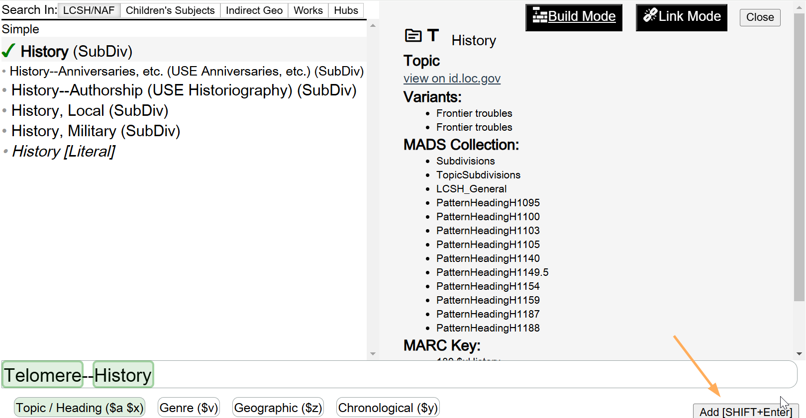

1. Click in the box with the heading **Telomere**. Marva will search for the URI for this individual component. Click on Telomere (Auth Hd), then click on **Topic / Heading ($a $x)** beneath the search box.

2. Next click in the box with **History**. Marva will search for the URI for this topical subdivision.

The components do not need to be controlled in order.

Click on History (SubDiv), then click on **Topic / Heading ($a $x)** beneath the search box.

Click on **Add [SHIFT+Enter]**. The LCSH string will be added as a Subject Added Entry - Topical Term in Marva. The thesaurus will be: Library of Congress subject headings.

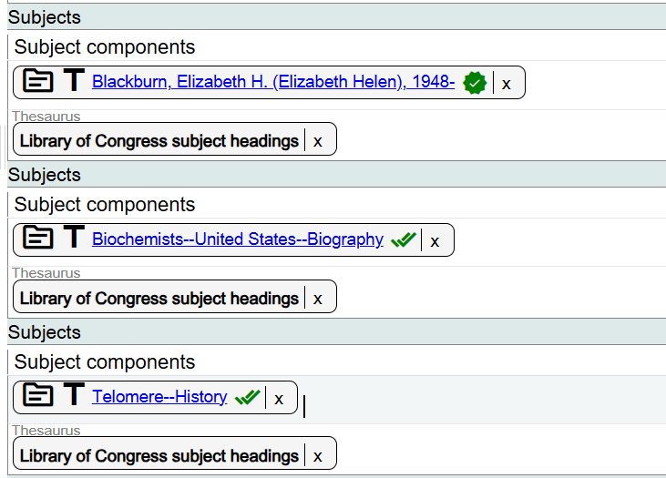

---

## Link Mode

If you know MARC LCSH coding, you can use the Link Mode to assign LCSH strings in Marva.

Using the example Biochemists--United States--Biography, the MARC string is `$a Biochemists $z United States $v Biography`.

In a Subject component in Marva, key in `Biochemists $z United States $v Biography`. Include the subfield values and the dollar sign as the delimiter for the subdivisions, but not for the main heading (do not use subfield $a).

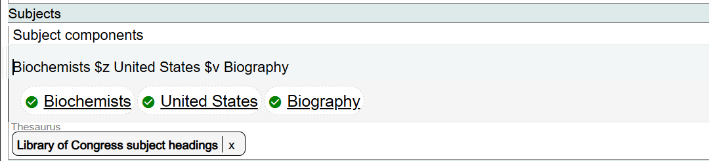

Marva will search for the URIs for the individual components and identify them with green checks directly in the Subject component box. Using Link Mode, there is no need to search directly in Build Mode.

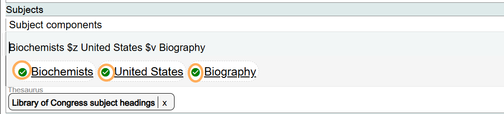

To change or edit information in the subject component, best practice is to delete the component that is not correct, and add a new component to search for the correct subject string.

---

## Using Literal Values as LCSH Subjects

There are some situations where you will need to select a literal value for an authorized LCSH subject heading. These situations arise when you are dealing with what is called a "multiple" subdivision record.

A "multiple" subdivision is a subdivision in the subject authority file that incorporates bracketed terms, generally followed by the word *etc.* This device is used to suggest the creation of similar subdivisions under the heading in question. The presence of a multiple subdivision under a heading in the subject authority file automatically gives free-floating status to analogous subdivisions under the same heading, and, if the heading is a pattern heading, under those headings that it controls.

For example, **--Dictionaries--French, [Italian, etc.]** is a multiple subdivision record that can be used as a form subdivision under subjects. Any appropriate language can be used with --Dictionaries on a free-floating basis.

When using a multiple subdivision record as the basis for an LCSH subdivision in Marva, use the **Literal Value** to capture the correct subdivision.

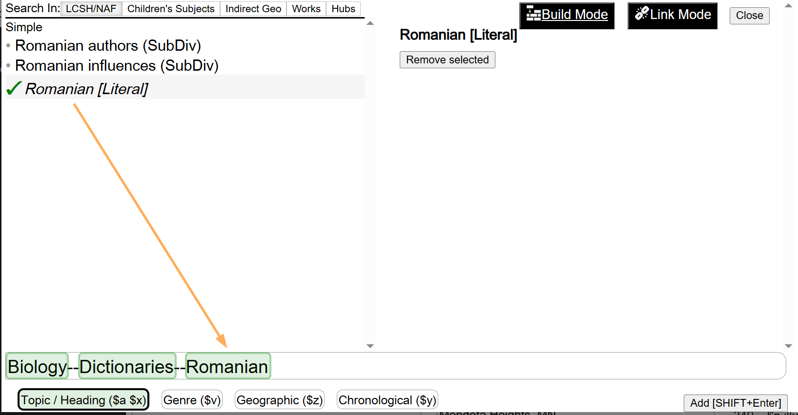

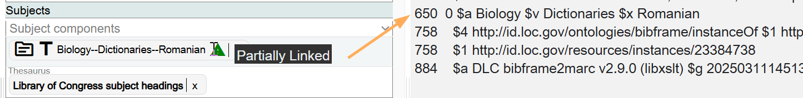

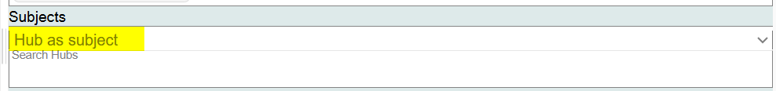

---

## Hub as Subject

Works may be used as subject access points in bibliographic descriptions, following the instructions in the Subject Headings Manual (SHM):

| SHM Instruction | Topic |
|-----------------|-------|
| H1155_6 | Literary Works Entered Under Author |
| H1155_8 | Literary Works Entered Under Title |
| H1295 | Bible: Special Topics |
| H1300 | Bible and Other Sacred Works |
| H1435 | Commentaries on Individual Works |

Works will be represented by Hubs in BIBFRAME and in Marva. Always use the option **Hub as subject** when selecting a work as a subject access point.

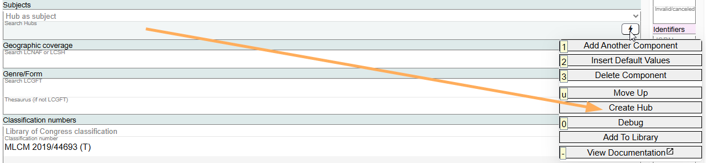

If you do not find the Hub that is needed:

1. If you would create a title or name-title authority record in the LC/NACO Authority File for the work, create a NAR in Folio and wait for the record to migrate to the Marva view of the LC/NACO Authority File. This should take 5 minutes. This option is generally followed when a work is needed for a subject entry and the work is not represented by a bibliographic record in the LC database (see DCM Z1, Introduction).

2. If you would not create a title or a name-title authority record in the LC/NACO Authority File for the expression, create a Hub in Marva.

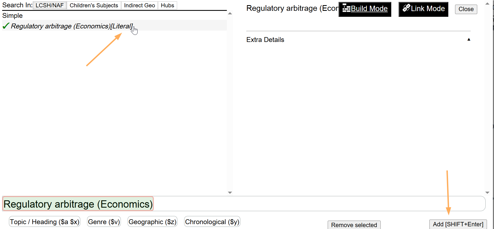

See [Appendix E: Hubs](../appendices/e-hubs.md) for more information.

---

## LCSH Subject Proposals

If you need to submit an LCSH subject proposal, there will not be a link to use in Marva until the subject proposal is approved. Just as in MARC cataloging, you can add an access point in Marva for an LCSH heading that is being proposed. "Claim" the heading as a literal value and select **Library of Congress Subject Headings** as the Thesaurus.

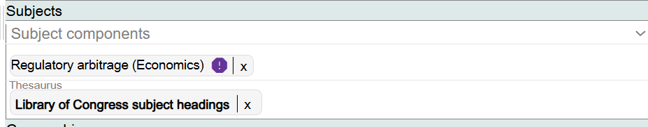

[Back to Table of Contents](../index.md)
