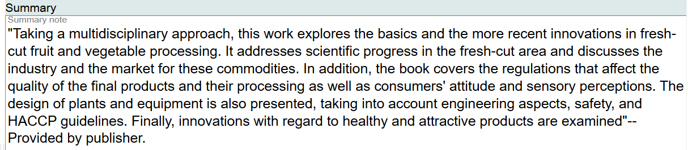

# Summary

## Scope

This component is used for a summary of the Work.

## Folio / MARC

- 520 field, Summary, etc.

## Summary Note

This is a literal field. Key in or paste the summary here. Ending punctuation is optional.

To change or edit information in this component, use the delete key and update as needed. This is a literal value so treat it as regular text.

[Back to Table of Contents](../index.md)
