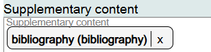
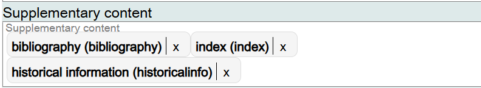
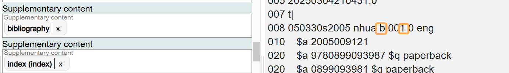
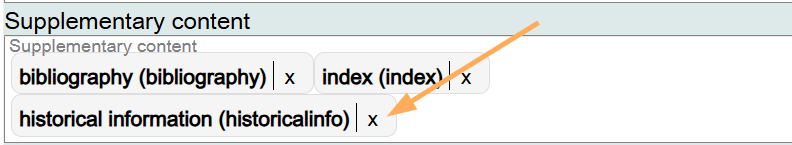
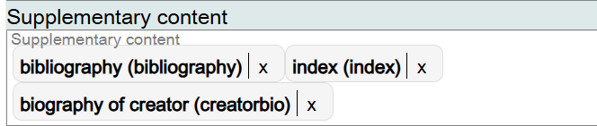

# Supplementary Content

## Scope

This component is used to identify the presence of bibliographies, indexes, etc. in the Work.

## Folio / MARC

- 008/24-27, Nature of Contents
- 008/31, Index

## Supplementary Content

This is a drop-down list for controlled values. Select the appropriate value(s).

If you want to record additional values for Supplementary content values in the Work, they can be added in the same field.

> **Important:** In order to populate both the 008 values for Bibliographies (Nature of contents = b) and Index (008/31), the Supplementary content component must be repeated.

To change information in this component, click on the **X** next to the Supplementary content value, and search for the new value.

If the component is no longer needed, delete it.

[Back to Table of Contents](../index.md)
