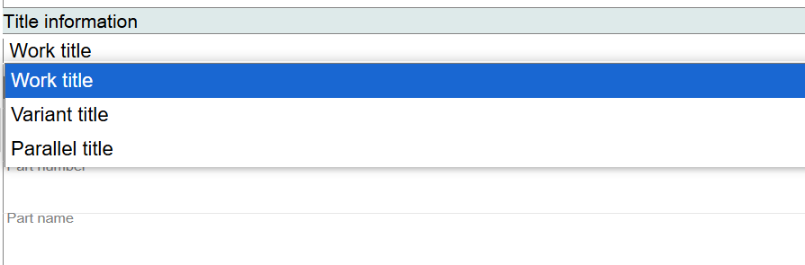
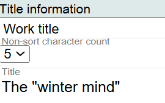
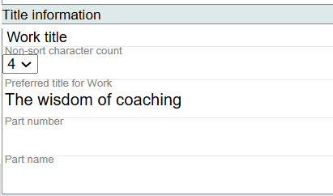
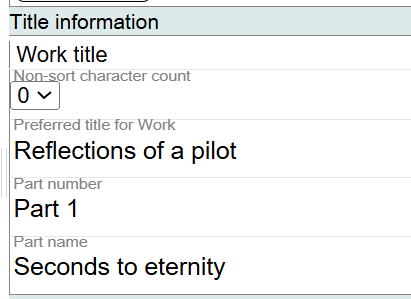
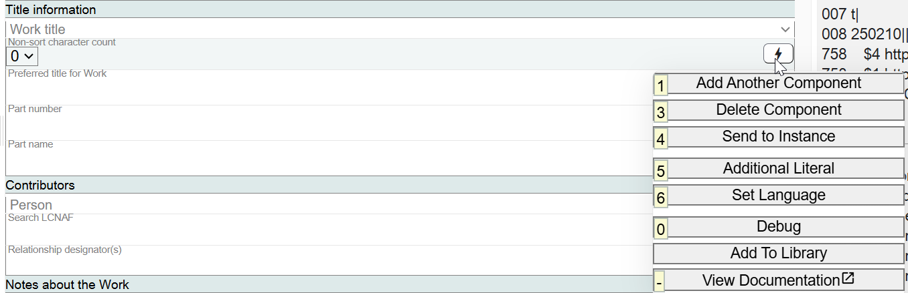
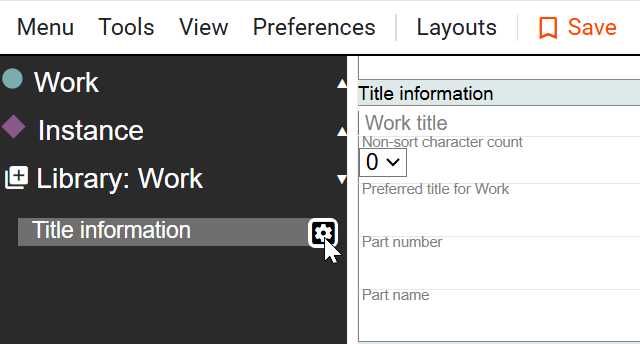

# Title Information

## Scope

This area is used for the Title Proper of the Work. Title information does not include Other Title Information.

## Folio / MARC

- 245 subfield $a title

If there is a numerical or part designation in the title, Title information in Marva will also use the 245 subfield $n and/or subfield $p.

## Work Title

The Title information component offers these title types:

- **Work title** (default)
- Variant title
- Parallel title

## Non-sort Character Count

If there is an initial article or any other non-sort values that need to be accounted for, select the non-filing value count from the drop-down list.

In Folio, this is 245 indicator 2.

## Title

Transcribe the Title Proper. This is a literal value so there is no lookup. Do not use ISBD punctuation.

## Part Number

Transcribe the Part number, if needed. This is a literal value so there is no lookup. Do not use ISBD punctuation.

## Part Name

Transcribe the Part name, if needed. This is a literal value so there is no lookup. Do not use ISBD punctuation.

To modify the information in this component, highlight the text and press the delete or backspace key. Since these are literal values, treat them as regular text.

## July 2025 Best Practice for Recording Parallel Titles and Variant Titles

If you want to record a Parallel title or a Variant title that is different from the Preferred title for Work, you can add new Work Title information components for the titles. Do not use ISBD punctuation. Keep in mind that titles associated with a location, such as Spine title, Caption title, or Binder title, are more appropriate as Instance Title variants.

## Title: Lightning Bolt Menu

Clicking on the lightning bolt button in the far right of a field will open a menu with options:

- **Add Another Component**: repeats the entire component. In this example, another Title information component will be added. Keep in mind that some components would not be repeated, though. There can only be one Creator of Work, for example.
- **Delete Component**: deletes the entire component.
- **Send to Instance**: copies the entire component to the Instance entity of the description.
- **Additional Literal**: adds an additional literal field. This option is at the field level only, not at the component level.
- **Set Language**: gives the option to add language and script metadata tags to the data in field. Used for Non-Latin resource cataloging only.
- **Debug**: shows the JSON (JavaScript Object Notation) view of the data. Used for troubleshooting data in the field.
- **Add to Library**: allows you to copy and save a component to the Marva Library so you can use it again in other descriptions. The Marva Library shows up in the Navigation Panel.
- **View Documentation**: points to external documentation in Confluence or in GitLab.

[Back to Table of Contents](../index.md)
